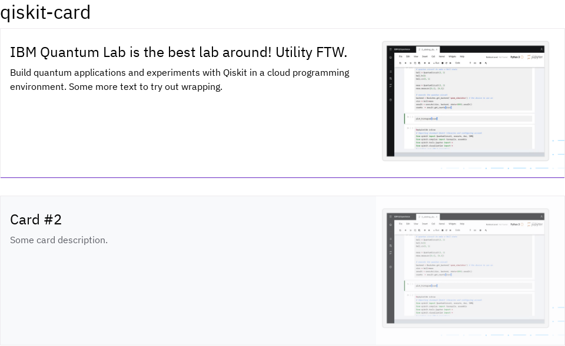
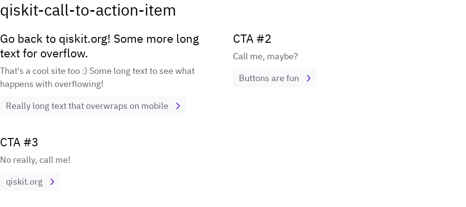

# qiskit-sphinx-theme
The Sphinx theme for Qiskit ecosystem documentation.

### Warning: new theme migration

In qiskit-sphinx-theme 1.14, we replaced the old `qiskit_sphinx_theme` based on Pytorch with the new `qiskit-ecosystem` theme based on Furo. The old theme was removed in qiskit-sphinx-theme 2.0.

See [Migrate from old Pytorch theme to new theme](https://github.com/Qiskit/qiskit_sphinx_theme/blob/1.16/README.md#migrate-from-old-pytorch-theme-to-new-theme) for migration instructions.

## Overview

This repository hosts three things: 
- `qiskit-ecosystem` theme (located in the `src/` folder)
- example docs (located in the `example_docs/` folder)
- Qiskit Docs Guide (located in the `docs_guide/` folder)

The `qiskit-ecosystem` theme is used by projects in the [Qiskit ecosystem](https://www.ibm.com/quantum/ecosystem).

The example docs are a minimal Sphinx project that is used for testing the Qiskit Sphinx Theme. Every
pull request will trigger [a GitHub workflow](https://github.com/Qiskit/qiskit_sphinx_theme/blob/main/.github/workflows/main.yml) that builds the example docs to make sure the changes do
not introduce unintended changes.

The Qiskit Docs Guide hosts instructions, guidelines and recommendations of good documentation
practices. Its intent is to help Qiskit maintainers improve the documentation of their projects.
The guide is hosted online here: https://qisk.it/docs-guide.

## Installation

This package is available on PyPI using:

```bash
pip install qiskit-sphinx-theme
```

Then, set up the theme by updating `conf.py`:

1. Set `html_theme = "qiskit-ecosystem"`
2. Add `"qiskit_sphinx_theme"` to `extensions`

You also likely want to set `html_title` in `conf.py`. This results in the left sidebar having a more useful and concise name, along with the page title in the browser. Most projects will want to use this in their `conf.py`:

```python
# Sphinx expects you to set these already.
project = "My Project"
release = "4.12"

# This sets the title to e.g. `My Project 4.12`.
html_title = f"{project} {release}"
```

## Enable translations

Refer to [Sphinx's internationalization guide](https://www.sphinx-doc.org/en/master/usage/advanced/intl.html) for how to build your documentation with different languages.

Once you have the translated documentation, you will need to start additionally deploying your docs to `<project-prefix>/locale/<locale-code>/`, e.g. `https://qiskit-community.github.io/qiskit-finance/locale/de_DE/index.html`.

Finally, update your `conf.py`:

* Ensure that `qiskit_sphinx_theme` is in the `extensions` setting.
* Set the option `translations_list` to a list of pairs of the locale code and the language name, e.g. `[..., ("de_DE", "German")]`.
* Set the option `docs_url_prefix` to your project's URL prefix, like `qiskit-finance`.

For example:

```python
extensions = [
   ...,
   "qiskit_sphinx_theme",
]

translations_list = [
    ('en', 'English'),
    ('bn_BN', 'Bengali'),
    ('fr_FR', 'French'),
    ('de_DE', 'German'),
]

docs_url_prefix = "qiskit-finance"
```

## Enable Previous Releases

This feature allows you to link to previous versions of the docs in the left sidebar.

First, start additionally deploying your docs to `<project-prefix>/stable/<version>/`, e.g. `https://qiskit-community.github.io/qiskit-experiments/stable/0.5/index.html`. See https://github.com/qiskit-community/qiskit-experiments/blob/7a0924c24549ab4f38819a86c0ac49214d819ba2/.github/workflows/docs_stable.yml#L25-L38 for an example.

Then, update your `conf.py`:

* Ensure that `qiskit_sphinx_theme` is in the `extensions` setting.
* Add to the option `html_context` an entry for `version_list` with a list of the prior versions, e.g. `["0.4", "0.5"]`.
  * Each of these versions must be deployed with the above `stable/<version>` URL scheme.
  * You can manually set this, or some projects write a Sphinx extension to dynamically compute the value.
  * You should only put prior versions in this list, not the current release.
* Set the option `docs_url_prefix` to your project's URL prefix, like `qiskit-experiments`.

For example:

```python
extensions = [
   ...,
   "qiskit_sphinx_theme",
]

html_context = {
   "version_list": ["0.4", "0.5"],
}

docs_url_prefix = "qiskit-experiments"
```

## Use custom RST directives

The `qiskit_sphinx_theme` extension defines the below custom directives for you to use in RST, if you'd like. See `example_docs/docs/sphinx_guide/custom_directives.rst` for examples of how to use them.

* `qiskit-card`
* `qiskit-call-to-action-item` and `qiskit-call-to-action-grid`




## Add a custom logo

You can add a custom logo by adding a logo file (SVG or PNG) as a sibling to your `conf.py`, e.g. `docs/logo.svg`. Then, set `html_logo` in `conf.py` to the name of the file, e.g. `html_logo = "logo.png"`.

When using a custom logo, you may want to disable the project's name in the sidebar by setting `sidebar_hide_name` in `html_theme_options` in `conf.py`:

```python
html_theme_options = {
    "sidebar_hide_name": True,
}
```

## Qiskit ecosystem members

If your project is a member of the [Qiskit ecosystem](https://www.ibm.com/quantum/ecosystem), we encourage you to set the following configuration so that the left sidebar mentions your project being in the ecosystem.

Update `conf.py`:

```python
html_theme_options = {
    "sidebar_qiskit_ecosystem_member": True,
}
```

Non-ecosystem members should not set this option.

## Tip: suggested site structure

To keep UX/UI similar across different Qiskit ecosystem packages, consider using the following structure for your sidebar, which can be set in the toctree of your `index.rst`:

```rst
.. toctree::
  :hidden:

   Documentation Home <index>
   Getting Started <getting_started>
   Tutorials <tutorials/index>
   How-to Guides <how_to/index>
   API Reference <apidocs/index>
   Explanations <explanations/index>
   Release Notes <release_notes>
   GitHub <https://github.com/your-repo>
```

Each item in the toctree corresponds to a single `.rst` file, and can use internal links or external. External links will have a "new tab" icon rendered next to them.
