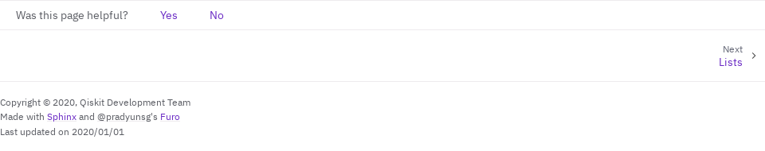

# qiskit_sphinx_theme
The Sphinx theme for the Qiskit documentation.

### Warning: new theme migration

In qiskit-sphinx-theme 1.13, we migrated the theme from Pytorch to Furo, which brings several improvements. The old Pytorch theme will be removed in qiskit-sphinx-theme 2.0, which we expect to release in July or August 2023.

See the section [Migrate from old Pytorch theme to new theme](#migrate-from-old-pytorch-theme-to-new-theme) for migration instructions.

## Overview

This repository hosts three things: 
- Qiskit Sphinx theme (located in the `src/` folder)
- Example Docs (located in the `example_docs/` folder)
- Qiskit Docs Guide (located in the `docs_guide/` folder)

The Qiskit Sphinx Theme is the theme used by Qiskit Documentation (https://qiskit.org/documentation/) and Qiskit Ecosystem projects.

The Example Docs is a minimal Sphinx project that is used for testing the Qiskit Sphinx Theme. Every
pull request will trigger [a GitHub workflow](https://github.com/Qiskit/qiskit_sphinx_theme/blob/main/.github/workflows/main.yml) that builds the Example Docs to make sure the changes do
not introduce unintended changes.

The Qiskit Docs Guide hosts instructions, guidelines and recommendations of good documentation
practices. Its intent is to help Qiskit maintainers improve the documentation of their projects.
The guide is hosted online here: https://qisk.it/docs-guide.

## Installation

This package is available on PyPI using:

```bash
pip install qiskit-sphinx-theme
```

Then, set up the theme by updating `conf.py`:

1. Set `html_theme = "qiskit"`
2. Add `"qiskit_sphinx_theme"` to `extensions`

## Slow Sphinx build? Limit `navigation_depth`

By default, every subpage is included in the left table of contents. This can result in incredibly slow build times, especially when you have API documentation. It can also substantially increase the size of your HTML pages, which worsens the load time for the site.

You can speed up your build by setting `navigation_depth` in `html_theme_options` in `conf.py` to a number like `1` or `2`:

```python
html_theme_options = {"navigation_depth": 2}
```

However, keep in mind that it is usually a nicer experience for users to have subpages rendered because it makes it easier to navigate the site. So, experiment with a value like `2` or `3` that balances Sphinx build speed with the user experience. Nevertheless, some projects like Qiskit have so many subpages that they may need to set `1`, which is okay.

Another option is to dynamically set the `navigation_depth` by using environment variables; set a lower value in development and a higher value or `-1` in production builds. For example, set up your `conf.py` like this:

```python
import os

html_theme_options = {
   "navigation_depth": os.getenv("NAVIGATION_DEPTH", 1)
}
```

## Enable translations

First, coordinate with the Translations team at https://github.com/qiskit-community/qiskit-translations to express your interest and to coordinate setting up the infrastructure.

Once the Translations team is ready, then update your `conf.py`:

* Ensure that `qiskit_sphinx_theme` is in the `extensions` setting.
* Set the option `translations_list` to a list of pairs of the locale code and the language name, e.g. `[..., ("de_DE", "German")]`.
* Set the option `docs_url_prefix` to your project's URL prefix, like `ecosystem/finance`.

For example:

```python
extensions = [
   ...,
   "qiskit_sphinx_theme",
]

translations_list = [
    ('en', 'English'),
    ('bn_BN', 'Bengali'),
    ('fr_FR', 'French'),
    ('de_DE', 'German'),
]

docs_url_prefix = "ecosystem/finance"
```

## Enable Previous Releases

This feature allows you to link to previous versions of the docs in the left sidebar.

First, start additionally deploying your docs to `<project-prefix>/stable/<version>/`, e.g. `/ecosystem/finance/stable/0.5/index.html`. See https://github.com/Qiskit/qiskit-experiments/blob/227867937a08075092cd11756214bee3fb1d4d3d/tools/deploy_documentation.sh#L38-L39 for an example.

Then, update your `conf.py`:

* Ensure that `qiskit_sphinx_theme` is in the `extensions` setting.
* Add to the option `html_context` an entry for `version_list` with a list of the prior versions, e.g. `["0.4", "0.5"]`.
  * Each of these versions must be deployed with the above `stable/<version>` URL scheme.
  * You can manually set this, or some projects write a Sphinx extension to dynamically compute the value.
  * You should only put prior versions in this list, not the current release.
* Set the option `docs_url_prefix` to your project's URL prefix, like `ecosystem/finance`.

For example:

```python
extensions = [
   ...,
   "qiskit_sphinx_theme",
]

html_context = {
   "version_list": ["0.4", "0.5"],
}

docs_url_prefix = "ecosystem/finance"
```

## Use custom RST directives

The `qiskit_sphinx_theme` extension defines the below custom directives for you to use in RST, if you'd like. See `example_docs/docs/sphinx_guide/custom_directives.rst` for examples of how to use them.

* `qiskit-card`
* `qiskit-call-to-action-item` and `qiskit-call-to-action-grid`


## Enable Qiskit.org Analytics

Qiskit.org uses Segment Analytics to collect information on traffic to sites under the qiskit.org domain. This is not enabled by default but if you would like to enable it you can add a `analytics_enabled` variable to the `html_context` object in your `conf.py`. Setting this to `True` will enable analytics for your site once it is deployed to `qiskit.org/`.

```python
html_context = {
    'analytics_enabled': True
}
```

By enabling analytics we will be able to collect information on number of visits to each documentation page. It will also trigger the addition of a `Was this page helpful?` component at the bottom of each documentation page, so users will be able to provide yes/no feedback for each page.



If you do not enable analytics, no data will be collected and the `Was this page helpful?` component will not show.

## Migrate from old Pytorch theme to new theme

In qiskit-sphinx-theme 1.13, we migrated to a new Sphinx theme based on Furo, which is used by pip, Black, and attrs documentation. See https://github.com/Qiskit/qiskit_sphinx_theme/issues/232 for the motivation.

qiskit-sphinx-theme 1.13 continues to support the legacy Pytorch theme, but support will be removed in version 2.0.

To migrate, in `conf.py`:

1. Ensure that `"qiskit_sphinx_theme"` is in the `extensions` list.
2. Set `html_theme = "qiskit"` rather than `"qiskit_sphinx_theme"`.
3. Remove all `html_theme_options`.
4. Decide if you need to limit `navigation_depth` for the number of subfolders allowed in the left sidebar. The old theme hardcoded a value of `1`, whereas the new theme defaults to `-1` (unlimited subpages). Refer to [Slow Sphinx build? Limit `navigation_depth`](#slow-sphinx-build-limit-navigation_depth).

Then, render the docs and check that everything looks how expected. If not, please open a GitHub issue or reach out on Slack for help.

## Tip: suggested site structure

To keep UX/UI similar across different Qiskit packages, we encourage the following structure for you sidebar, which can be set in the toctree of your `index.rst`:

```rst
.. toctree::
  :hidden:

   Documentation Home <index>
   Getting Started <getting_started>
   Tutorials <tutorials/index>
   How-to Guides <how_to/index>
   API Reference <apidocs/index>
   Explanations <explanations/index>
   Release Notes <release_notes>
   GitHub <https://github.com/your-repo>
```

Each item in the toctree corresponds to a single `.rst` file, and can use internal links or external. External links will have a "new tab" icon rendered next to them.
